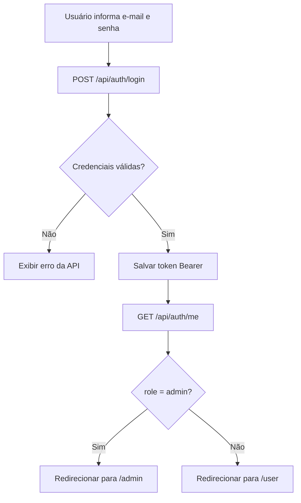
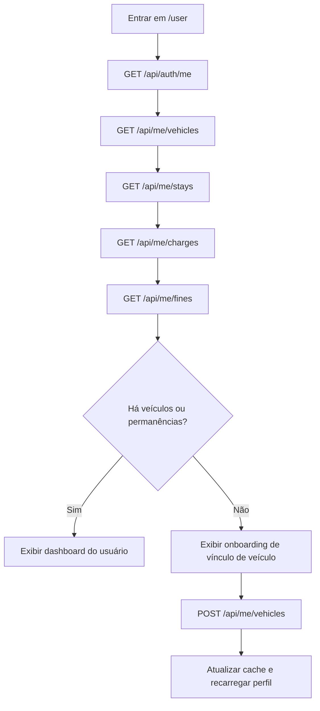

# Relatório da refatoração Vue e autenticação

O projeto foi alinhado para ter back-end Laravel com autenticação via Sanctum e front-end em Vue 3, Vite, TypeScript, Vue Router, Pinia, Axios, TanStack Vue Query e Composition API.

## Endpoints encontrados e integrados

### Autenticação

- `POST /api/auth/login`
- `GET /api/auth/me`
- `POST /api/auth/logout`

### Área do usuário autenticado

- `GET /api/me/vehicles`
- `POST /api/me/vehicles`
- `GET /api/me/stays`
- `GET /api/me/charges`
- `GET /api/me/fines`
- `POST /api/me/charges/{charge}/pay`

### Área administrativa

- `GET /api/admin/users`
- `GET /api/admin/zones`
- `GET /api/admin/vehicles`
- `GET /api/admin/stays`
- `POST /api/admin/stays/entry`
- `POST /api/admin/stays/exit`
- `GET /api/admin/charges`
- `GET /api/admin/fines`
- `POST /api/admin/charges/{stay}`
- `GET /api/admin/charges/{plate}`
- `POST /api/admin/charges/{charge}/pay/{user}`
- `POST /api/admin/user/{user}/vehicles`
- `GET /api/admin/user/{user}/stays`

As rotas de CRUD de zonas continuam registradas pelo `apiResource`, mas somente a listagem possui implementação útil no controller analisado.

## Modelos e entidades

- `User`: nome, e-mail, senha, `role`, saldo disponível e relacionamento com veículos/carteira.
- `Wallet`: carteira do usuário usada para pagamento de cobranças.
- `Vehicle`: placa, tipo, status de cadastro e vínculos com usuários.
- `Zone`: zona de estacionamento e tempo máximo.
- `Tariff`: tarifa ativa por zona.
- `Stay`: entrada, saída, tempo total, status, veículo e zona.
- `Charge`: valor, vencimento, status e permanência vinculada.
- `Payment`: pagamento gerado a partir de cobrança e carteira.
- `Fine`: multa vinculada a usuário e permanência, com motivo e status.

## Mapeamento User vs Admin

- Usuário comum: acessa somente `/api/me/*`, consulta seus veículos, permanências, cobranças e multas, vincula veículo à própria conta e paga cobrança vinculada à própria conta.
- Administrador: acessa `/api/admin/*`, consulta usuários, veículos, zonas, permanências, cobranças e multas, registra entrada/saída, gera cobrança, paga cobrança com usuário informado e vincula veículo a usuário.
- A navegação do front usa exclusivamente o campo `role` retornado por `/api/auth/me`.

## Fluxograma de autenticação



## Fluxograma da Home do usuário



## Estrutura final do front-end

```text
front-end-ir-e-vir/
├── index.html
├── package.json
├── vite.config.ts
└── src/
    ├── api/
    ├── assets/
    ├── components/
    ├── layouts/
    ├── pages/
    ├── router/
    ├── services/
    ├── stores/
    ├── types/
    ├── utils/
    ├── App.vue
    └── main.ts
```

## Ausências confirmadas

- Cadastro público: Informação não encontrada no back-end analisado.
- Recuperação de senha: Informação não encontrada no back-end analisado.
- Depósito ou extrato direto de carteira: Informação não encontrada no back-end analisado.
- Pagamento direto de multas: Informação não encontrada no back-end analisado.
- CRUD completo de zonas: rotas registradas, mas métodos sem implementação útil.

## Inconsistências encontradas

- O Swagger salvo diverge das rotas e validações reais.
- O front antigo apontava para `/api/v1`, mas as rotas reais usam `/api`.
- A implementação anterior não possuía login, perfil e separação user/admin.
- O fluxo de permanência usava nomes e status incompatíveis com a tabela; isso foi corrigido no back-end para usar `ACTIVE`, `entry` e `exit`.
- O MVP agora evita cobrança duplicada por permanência e vínculo duplicado entre usuário e veículo por migrations novas.

## Validação

- `php artisan route:list --path=api` validou o registro das rotas.
- `php -l` foi executado nos novos arquivos PHP.
- `php artisan migrate --pretend` validou as migrations novas.
- `php artisan test` passou com 8 testes e 27 assertions.
- `npm run build` passou em `front-end-ir-e-vir`.
- `npm run dev -- --host 127.0.0.1 --port 5173 --strictPort` iniciou corretamente quando executado em primeiro plano; o ambiente bloqueou as tentativas de manter o processo em segundo plano.
